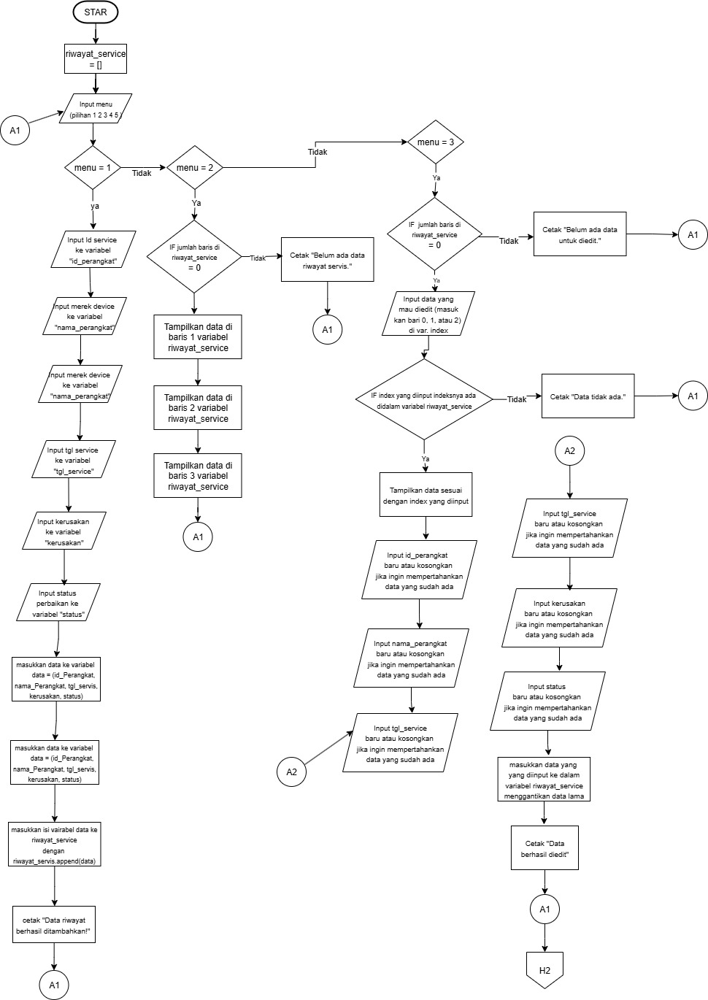
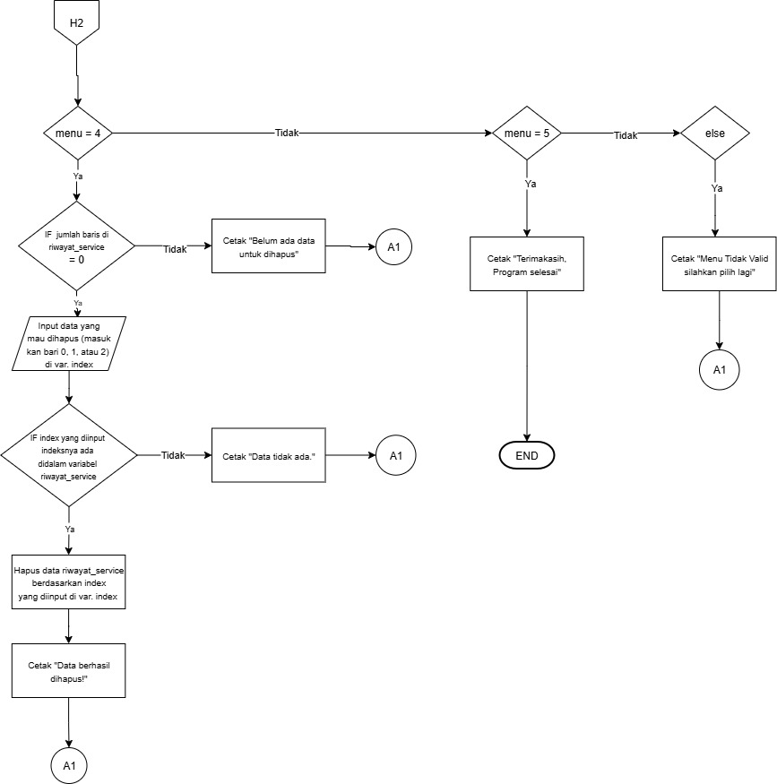
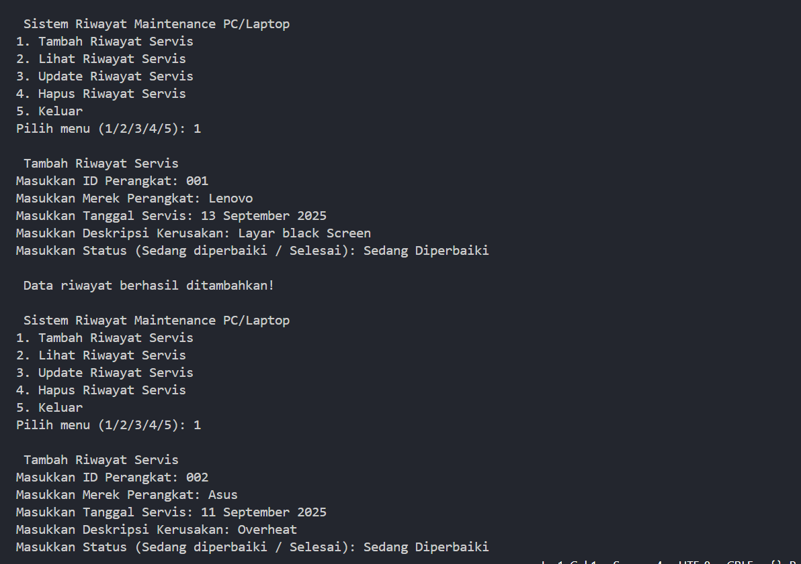
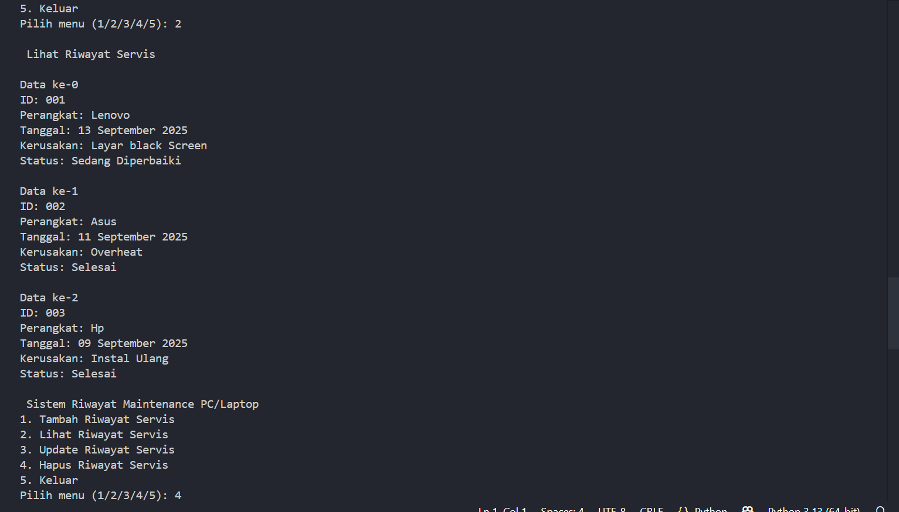
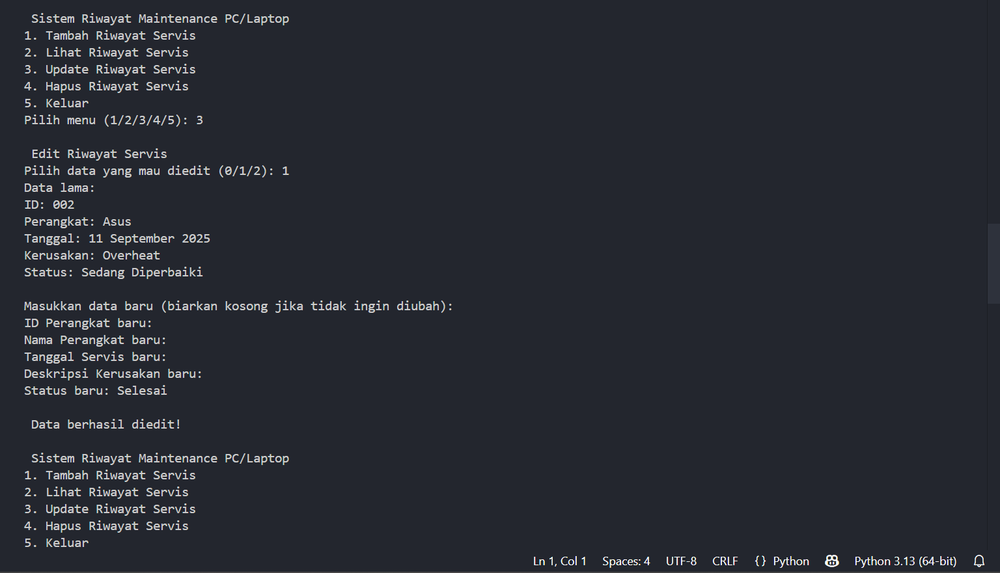
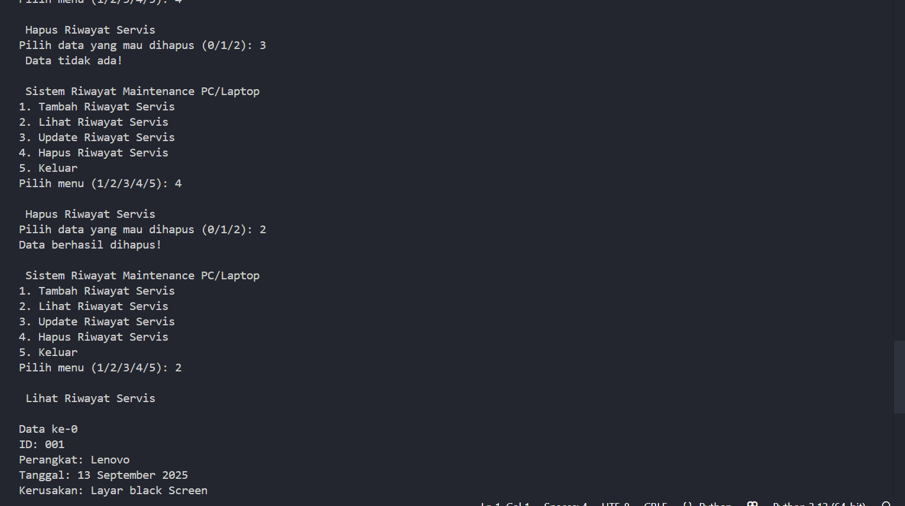

---
aliases:
  - "MINPRO 1: SISTEM RIWAYAT MAINTENANCE PC/LAPTOP PADA BAHASA PEMROGRAMAN PYHON"
---
**Nama: Condrado Alain Sharon
NIM: 2509116069**

Python adalah sebuah bahasa pemrograman yang umum digunakan khususnya dibidang data scientis atau pembuatan AI dan machine learning. Namun tidak terbatas disitu saja, python sebenarnya bisa dipakai untuk membuat beberapa program sederhana. Pada mini project kali ini saya akan membuat sebuah **sistem riwayat maintenance PC/LAPTOP**, dimana akan memakai konsep CRUD (Create, read,update, dan delete). Berikut adalah penjelasan, alur pemrograman beserta kode program sederhana ini:

# Penjelasan dan Fitur Program

Program ini memiliki fitur-fitur yaitu untuk menambah riwayat maintenance laptop/pc. Data yang akan ditambahkan adalah:
- ID: adalah inisialisasi yang akan membedakan antara data riwayat 1 dengan yang lainnya. Karena program ini sangat sederhana, dampaknya tidak akan terlhat, namun jika diintegrasikan dengan sistem skala besar maka id ini adalah kode unik yang benar-benar sangat membantu agar tidak terjadinya duplikasi data. saya menggunakan id ini terinspirasi dari proyek-proyek web saya dimana saya akan menggunakan ID disetiap data untuk tabel database untuk menghindari duplikasi.
- nama perangkat: adalah merek dan tipe perangkat yang akan diservice.
- tanggal service: adalah tanggal dimulainya perangkat diservice, atau tanggal mulai diberikannya perangkat untuk ditindaklanjuti atau diservice
- kerusakan: adalah deskripsi kerusakan dari perangkat
- status: adalah status pengerjaan perangkat. Memiliki 2 nilai yaitu Sedang Dikerjakan / Selesai.

Pada fitur pertama, user akan diminta untuk menginput data-data diatas. data-data tersebut nantinya akan dimasukkan ke dalam masing-masing variabel yang akan dibuat di program. Setelah penginputan data, fitur kedua adalah melihat data yang diinput. Data yang diinput tadi bisa kita lihat melalui fitur yang kedua ini. Fitur yang ketiga adalah mengedit (update) data yang telah diinput. Data yang telah diinput dapat diedit dengan fitur yang ketiga ini. Yaitu nantinya user akan memilih terlebih dahulu data yang akan diinput (melalui urutan baris dan index) kemudian user akan menginput data baru yang nantinya akan menimpa data yang lama. Jika ada data yang tidak mau diedit, maka user bisa mengosongkan inputan. Fitur terakhir adalah delete, yaitu user akan diminta menginput data yang akan dihapus dengan memilih urutan index dan baris data perangkat yang akan dihapus.

# Flowchart
## Gambar Flowchart




## Penjelasan Flowchart
1. Program akan dimulai dengan start
2. Setelah itu Program akan membuat sebuah list variabel kosong dengan nama `riwayat_servis`
3. Program meminta user untuk menginput angka 1- 4 ke dalam variabel `menu`. Ini berfungsi untuk user bisa memilih fitur.
	- Fitur pertama adalah untuk menambah data servis
	- Fitur kedua adalah untuk melihat data-data yang telah diinputkan
	- Fitur ketiga adalah untuk mengedit data_data yang ada
	- Fitur keempat adalah untuk menghapus data yang ada
4. Jika user menginput `1` kedalam variabel `menu` maka program akan meminta user untuk menginput data-data yaitu id, nama perangkat, dll. setelah data telah diinput maka program akan mencetak pesan bahwa data telah berhasil ditambahkan dengan pesan "data riwayat berhasil ditambahkan". setelah mencetak pesan program akan kembali ke input fitur
5. Jika user menginput `2` kedalam variabel `menu` maka program menampilkan data-data yang telah ditambahkan. Jika ada data yang ditambahkan maka data akan tampil, jika tidak maka program akan mencetak pesan "Belum ada data riwayat servis". Setelah itu program akan kembali ke input fitur.
6. Jika user menginput `3` kedalam variabel `menu` maka program akan meminta user untuk mengedit data-data yang telah ditambahkan. Pertama program akan mengecek program apakah sudah ada data yang ditambahkan atau belum. jika belum maka pesan akan mencetak "Belum ada data untuk diedit". Jika ada, maka program akan meminta user untuk menginput list index data yang akan diinput dari list `riwayat_service`. setelah itu Program akan meminta data baru untuk diinput. jika ada data yang tidak mau diubah, maka user bisa mengosongkannya. setelah itu, program akan mencetak pesan "data berhasil diedit", lalu program akan kembali ke input fitur.
7. Jika user menginput `4` kedalam variabel `menu` maka program akan masuk ke fitur delete. Pertama program akan mengecek apakah ada data yang terinput atau belum. jika belum maka akan muncul pesan "Tidak ada data yang untuk dihapus", jika ada, maka program akan meminta user menginput urutan index dari list `riwayat_service` yang user inginkan. Setelah  user menginput urutan index yang diinginkan, maka program akan menghapus index tersebut, dan secara tidak langsung akan menghapus data yang berhubungan dengan index list tadi, lalu program akan kembali ke input fitur.
8. Jika user menginput `5` ke dalam variabel `menu`, maka program akan menghentikan program dan dengan demikian maka program sampai di tahap end.

note: setiap alur program akan melakukan perulangan dengan kembali ke input fitur kecuali jika user menginput angka `5` di variabel `menu`.

# Program

## Kode Program

```python
riwayat_servis = []  

while True:

    print("\n Sistem Riwayat Maintenance PC/Laptop ")

    print("1. Tambah Riwayat Servis")

    print("2. Lihat Riwayat Servis")

    print("3. Update Riwayat Servis")

    print("4. Hapus Riwayat Servis")

    print("5. Keluar")


    menu = input("Pilih menu (1/2/3/4/5): ")

    if menu == "1":

        print("\n Tambah Riwayat Servis ")

        id_Perangkat = input("Masukkan ID Perangkat: ")

        nama_Perangkat = input("Masukkan Merek Perangkat: ")

        tgl_servis = input("Masukkan Tanggal Servis: ")

        kerusakan = input("Masukkan Deskripsi Kerusakan: ")

        status = input("Masukkan Status (Sedang diperbaiki / Selesai): ")
        data = (id_Perangkat, nama_Perangkat, tgl_servis, kerusakan, status)

        riwayat_servis.append(data)

        print("\n Data riwayat berhasil ditambahkan!")


    elif menu == "2":

        print("\n Lihat Riwayat Servis ")

        if len(riwayat_servis) == 0:

            print("Belum ada data riwayat servis.")

        else:

            if len(riwayat_servis) >= 1:

                data = riwayat_servis[0]

                print("\nData ke-0")

                print("ID:", data[0])

                print("Perangkat:", data[1])

                print("Tanggal:", data[2])

                print("Kerusakan:", data[3])

                print("Status:", data[4])

            if len(riwayat_servis) >= 2:

                data = riwayat_servis[1]

                print("\nData ke-1")

                print("ID:", data[0])

                print("Perangkat:", data[1])

                print("Tanggal:", data[2])

                print("Kerusakan:", data[3])

                print("Status:", data[4])

            if len(riwayat_servis) >= 3:

                data = riwayat_servis[2]

                print("\nData ke-2")

                print("ID:", data[0])

                print("Perangkat:", data[1])

                print("Tanggal:", data[2])

                print("Kerusakan:", data[3])

                print("Status:", data[4])  

    elif menu == "3":

        print("\n Edit Riwayat Servis ")

        if len(riwayat_servis) == 0:

            print("Belum ada data untuk diedit.")

        else:

            index = int(input("Pilih data yang mau diedit: "))

            if index < len(riwayat_servis):

                data = riwayat_servis[index]

                print("Data lama:")

                print("ID:", data[0])

                print("Perangkat:", data[1])

                print("Tanggal:", data[2])

                print("Kerusakan:", data[3])

                print("Status:", data[4])

                print("\nMasukkan data baru (biarkan kosong jika tidak ingin diubah):")

                id_Perangkat = input("ID Perangkat baru: ") or data[0]

                nama_Perangkat = input(

                    "Nama Perangkat baru: ") or data[1]

                tgl_servis = input("Tanggal Servis baru: ") or data[2]

                kerusakan = input("Deskripsi Kerusakan baru: ") or data[3]
                status = input("Status baru: ") or data[4]

                riwayat_servis[index] = (
                    id_Perangkat, nama_Perangkat, tgl_servis, kerusakan, status)

                print("\n Data berhasil diedit!")

            else:

                print(" Data tidak ada!")

    elif menu == "4":

        print("\n Hapus Riwayat Servis ")

        if len(riwayat_servis) == 0:

            print("Tidak ada data untuk dihapus.")

        else:

            index = int(input("Pilih data yang mau dihapus : "))

            if index < len(riwayat_servis):

                riwayat_servis.pop(index)

                print("Data berhasil dihapus!")

            else:

                print(" Data tidak ada!")
                
    elif menu == "5":
    
        print("\nTerima kasih, program selesai.")
        break

    else:
        print("\n Menu tidak valid, silakan pilih lagi.")
```

## Penjelasan

1. **Inisialisasi variabel**

`riwayat_servis = []`

- Ini adalah list kosong untuk menyimpan data maintenance servis yang akan diinput
- Setiap data nantinya akan disimpan sebagai list: `(id_perangkat, nama_perangkat, tgl_service, kerusakan, status`

2. **Perulangan menu**
```python
while True:
    print("\n Sistem Riwayat Maintenance PC/Laptop ")
    print("1. Tambah Riwayat Servis")
    print("2. Lihat Riwayat Servis")
    print("3. Update Riwayat Servis")
    print("4. Hapus Riwayat Servis")
    print("5. Keluar")

    menu = input("Pilih menu (1/2/3/4/5): ")
```

- `while True`: membuat perulangan dimana nantinya program akan terus kembali ke menu selama program tidak dihentikan (memilih menu 5).
- Selain itu bagian ini akan menampilkan menu utama beserta fitur-fitur yang akan diakses berdasarkan menu.
- input nantinya disimpan ke dalam variabel `menu`

3. **Menambahkan Data Maintenance (1)**
```python
if menu == "1":
    print("\n Tambah Riwayat Servis ")
    id_Perangkat = input("Masukkan ID Perangkat: ")
    nama_Perangkat = input("Masukkan Merek Perangkat: ")
    tgl_servis = input("Masukkan Tanggal Servis: ")
    kerusakan = input("Masukkan Deskripsi Kerusakan: ")
    status = input("Masukkan Status (Sedang diperbaiki / Selesai): ")

    data = (id_Perangkat, nama_Perangkat, tgl_servis, kerusakan, status)
    riwayat_servis.append(data)
    print("\n Data riwayat berhasil ditambahkan!")
```

- Jika user memasukkan 1 kedalam variabel menu, maka program akan menampilkan fitur inputan untuk menginput setiap data yaitu id perangkat (ditampung ke dalam variabel `id_perangkat`), nama perangkat (ditampung ke dalam variabel `nama_perangkat`), tanggal servis (ditampung ke dalam variabel `tgl_servis`), deskripsi kerusakan (ditampung ke dalam variabel `kerusakan`) dan status pengerjaan (ditampung ke dalam variabel `status`)
- `input` bertujuan untuk agar user bisa menginput data didalmnya
- Data data akan ditampung ke dalam sebuah tuple bernama `data`
- setelah itu tuple `data` tadi akan diinput kedalam list `riwayat_servis` tadi dengan fitur `riwayat_servis.append(data)`. append sendiri berfungsi untuk menambahkan elemen kedalam list
- jika berhasil maka program akan mencetak "data riwayat berhasil ditambahkan"

4. **Melihat riwayat servis**

```python
  elif menu == "2":
        print("\n Lihat Riwayat Servis ")
        if len(riwayat_servis) == 0:
            print("Belum ada data riwayat servis.")
        else:
            if len(riwayat_servis) >= 1:
                data = riwayat_servis[0]
                print("\nData ke-0")
                print("ID:", data[0])
                print("Perangkat:", data[1])
                print("Tanggal:", data[2])
                print("Kerusakan:", data[3])
                print("Status:", data[4])
  
            if len(riwayat_servis) >= 2:
                data = riwayat_servis[1]
                print("\nData ke-1")
                print("ID:", data[0])
                print("Perangkat:", data[1])
                print("Tanggal:", data[2])
                print("Kerusakan:", data[3])
                print("Status:", data[4])

            if len(riwayat_servis) >= 3:
                data = riwayat_servis[2]
                print("\nData ke-2")
                print("ID:", data[0])
                print("Perangkat:", data[1])
                print("Tanggal:", data[2])
                print("Kerusakan:", data[3])
                print("Status:", data[4])
```

- Pertama Program akan mengecek apakah ada data dalam list
- Pengecekan dilakukan dengan perintah `if len(riwayat_servis) == 0` yang artinya cek jumlah baris yang ada didalam list `riwayat_servis` (fungsi `len` adalah untuk mengecek baris dalam sebuah list atau tuple atau variabel). 
- jika tidak ada baris alias == 0 maka progam akan mencetak "Belum ada data riwayat servis"
- Jika ada, maka program akan mencetak seluruh data dengan cara setiap data akan dipanggil dengan `len(riwayat_servis) >= 1` yang artinya program memanggil baris 1 dari list (bukan index list yang memakai [0],[1], [2]). setelah baris 1 dipanggil barulah index yang ada di baris satu yaitu index[0] akan dipanggil dengan `data = riwayat_servis[0]`.
- artinya bahwa tampilkan data dari index pertama di list `riwayat_servis`
- Hal demikian terjadi untuk data di index 1 dan 2.
- Kesimpulannya adalah program akan membaca ketiga baris dari `riwayat_servis` kemudian mengambil nilai di tuple `data` berdasarkan inisialisasi index di list riwayat_index.

5. **Mengedit data**
```python
 elif menu == "3":
        print("\n Edit Riwayat Servis ")
        if len(riwayat_servis) == 0:
            print("Belum ada data untuk diedit.")
        else:
            index = int(input("Pilih data yang mau diedit: "))
            if index < len(riwayat_servis):
                data = riwayat_servis[index]
                print("Data lama:")
                print("ID:", data[0])
                print("Perangkat:", data[1])
                print("Tanggal:", data[2])
                print("Kerusakan:", data[3])
                print("Status:", data[4])
                print("\nMasukkan data baru (biarkan kosong jika tidak ingin diubah):")
                id_Perangkat = input("ID Perangkat baru: ") or data[0]
                nama_Perangkat = input(
                    "Nama Perangkat baru: ") or data[1]
                tgl_servis = input("Tanggal Servis baru: ") or data[2]
                kerusakan = input("Deskripsi Kerusakan baru: ") or data[3]
                status = input("Status baru: ") or data[4]

                riwayat_servis[index] = ( id_Perangkat, nama_Perangkat, tgl_servis, kerusakan, status)

                print("\n Data berhasil diedit!")
            else:
                print(" Data tidak ada!")
```

- Pertama program akan mengecek isi `menu` yang diinput oleh user.
- jika user menginput 3 maka program akan masuk ke fitur edit data riwayat maintenance
- Lalu program akan mengecek apakah sudah ada data didalam `riwayat_servis` atau belum dengan fitur `if len(riwayat_servis) == 0:`  yang artinya jika jumlah baris (diketahui menggunakan `len`) == 0 alias tidak ada, maka program akan mencetak pesan bahwa data tidak ada dengan kode `print("Belum ada data untuk diedit.")`.
- Jika data memang ada di `riwayat_service`, maka user diminta untuk menginput **baris** keberapa yang mereka pilih untuk di edit di list `riwayat_servis`, untuk kemudian ditampung di variabel `index` dengan kode ` index = int(input("Pilih data yang mau diedit: "))`
- Kemudian program akan mengecek, jika isi variabel `index` adalah kurang dari jumlah baris yang didalam list `riwayat_servis`, maka isi dari tuple `data` akan diinisialisasi berdasarkan isi dari variabel `index` tadi. jadi jika user mengisi misalnya "1" maka program akan memanggil data yang berada di baris satu list `riwayat_peminjaman.
- Setelah itu program akan menprint tiap data dibaris yang telah dipilih dengan kode contohnya `print("ID:", data[0])` yang artinya id akan menampilkan index ke-0 dari tuple data yang ada di list riwayat_servis
- setelah data lama ditampilkan maka program akan mempersilahkan user untuk menginput data baru menggantikan data yang lama dengan kode `  print("\nMasukkan data baru (biarkan kosong jika tidak ingin diubah):")` 
- Kemudian untuk mencegah agar tidak semua data harus diganti (bisa saja user hanya ingin mengganti 1 data tidak semua) maka pada bagian inputan ditambahkan perintah `or data[0]` yang artinya atau data tetap sesuai di index-0 di list saja
- Setelah semua diinput, semua data akan disimpan kembali ke list `riwayat_servis` pada index yang ada didalam variabel `index`

6. **Menghapus Data**
```python
elif menu == "4":
        print("\n Hapus Riwayat Servis ")
        if len(riwayat_servis) == 0:
            print("Tidak ada data untuk dihapus.")
        else:
            index = int(input("Pilih data yang mau dihapus : "))
            if index < len(riwayat_servis):
                riwayat_servis.pop(index)
                print("Data berhasil dihapus!")
            else:
                print(" Data tidak ada!")
```
- pertama, program akan mengecek apakah ada baris didalam list `riwayat_servis` dengan `if len(riwayat_servis) == 0:`. jika baris di list `riwayat_servis` , kosong alias == 0, maka progam akan mencetak bahwa data untuk dihapus tidak ada
- jika baris ada maka user akan diminta untuk menginput pada baris berapa di list riwayat_servis yang mau dihapus. angka baris tersebut akan ditampung di variabel `index`
- Kemudian program akan mengecek jika data yang diinput kedalam `index` lebih kecil daripada jumlah baris di list `riwayat)_servis`
- Jika iya maka program akan mulai menghapus data di riwayat_servis berdasarkan baris di `index` yang telah diinput saja

5. **Program keluar

```python
 elif menu == "5":
        print("\nTerima kasih, program selesai.")
        break
```

- Jika user memilih menu 5 maka program akan mencetak kata terimakasih 
- Setelah program mencetak kata teriamkasih, maka program akan langsung berhenti karena ada perintah `break` yang artinya distop

# Output

**Tambah Riwayat**


**Fitur kedua melihat data yang sudah diinput**


**Fitur ketiga untuk mengedit data yangg telah diinput**


**Fitur keempat untuk menghapus data**


**Jika mengisi menu 5 maka program akan otomatis berhenti**
.jpg)
